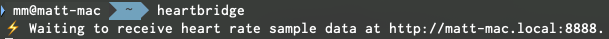
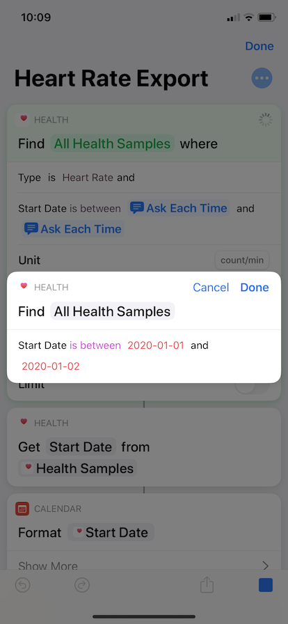
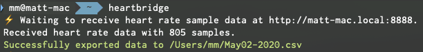
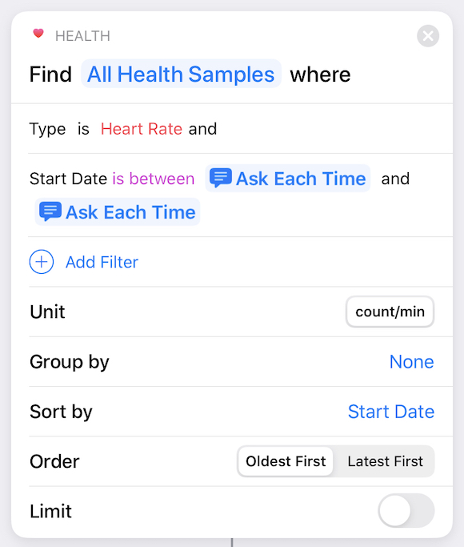

# iOS Heart Rate Data Export

[](https://travis-ci.com/mm/heartbridge)

Combined with an Apple Watch, the iOS Health app contains a wealth of heart rate readings. I always found these readings a little difficult to play with in the Health app, and couldn't find a way to easily export them to a format I could manipulate/visualize the readings using (like a JSON or CSV file).

Fortunately with the [Shortcuts](https://apps.apple.com/us/app/shortcuts/id915249334) app, accessing this data is a lot easier. This combines a shortcut with a quick HTTP API endpoint (using [Flask](http://flask.palletsprojects.com/en/1.1.x/)) to capture and store the data the shortcut exports. 

This Python script can receive data from Shortcuts, automatically export it to the directory of your choosing (in CSV or JSON format) and automatically name files according to what date range it covers. Exported files contain a time stamp ("Start Date" in Health) and heart rate ("Value" in Health).

**_Note_**: This is designed to be run on your local computer! It wasn't made to be deployed to a server (yet). Only run if you trust the devices on your local network.

## Requirements

You will need two things:

* A computer with Python (>=3.6) installed
* An iPhone with [Shortcuts](https://apps.apple.com/us/app/shortcuts/id915249334) installed, on the same network

On the first run, the shortcut will prompt for access to your Health data (particularly heart rate data).

## Getting Started

1. Clone this repository to your computer, and install required packages by opening up a terminal and typing the following:

```bash
git clone https://github.com/mm/heartbridge.git && cd heartbridge
pip install -r requirements.txt
```

2. Afterwards, run `app.py`, specifying where you want export files stored and in what format you want them exported to (JSON/CSV). For example, this command:

```bash
python3 app.py --directory ~/Desktop --type csv
```

... will save all exported files to the desktop in CSV format. If no arguments are specified, the script will output files in CSV format to the current working directory. Please make sure the folder exists before running the script.

3. Make note of the endpoint URL the script prints out, and ensure the script is allowed to accept incoming connections if your firewall prompts you. In this case, mine would be ```http://matt-mac-mini.local:5000/heartrate```:



4. On your iPhone, [download the shortcut to extract Health samples](https://www.icloud.com/shortcuts/2d24033f74bb493c8017e4986e6233bf). It will ask you what the API endpoint URL you just noted is.

5. Run the shortcut! You will be prompted to select the date range you want to cover. The end date of the date range you specify is not included in the data returned. For example, to get all data for January 1st, 2020:



The script will output information about the data it receives from the shortcut to the console:



6. The Flask server will continue to run and accept new data until stopped. Stop running the script (Ctrl-C) whenever you're finished exporting all the data you need. Enjoy exploring your heart rate data!

## Notes

### Shortcuts data format

This wasn't trivial to me, so I figured I'd write a quick bit on how the Health data is pulled using Shortcuts to begin with. The shortcut uses the "Find All Health Samples where" action:



This returns a result set of health samples including the start date of the reading, the value and the duration the reading was taken for. What I found difficult was exporting multiple attributes of this set's data at once -- I was only able to export the date into one array (an array of dates) and the actual heart rate value into one array (an array of values). Once these are tied into a dictionary, the resulting JSON the shortcut produces looks something like this:

```json
{
    "hrDates": ["16-12-2019 08:24:36","16-12-2019 08:26:39",...],
    "hrValues": ["74","72",...]
}
```

Both the ```hrDates``` and ```hrValues``` list is ordered in ascending order by start date. Doing it this way allowed me to avoid using a "Repeat with Each..." action on the health sample set which introduced a lot of slowness to the shortcut. 

Among other things, the Python script is used to combine those two arrays into a list of tuples. The above JSON would be transformed into ```[("16-12-2019 08:24:36", 74.0), ("16-12-2019 08:26:39", 72.0)]``` by the script, once it's received in an HTTP POST request. It's then converted to a CSV or JSON file. 